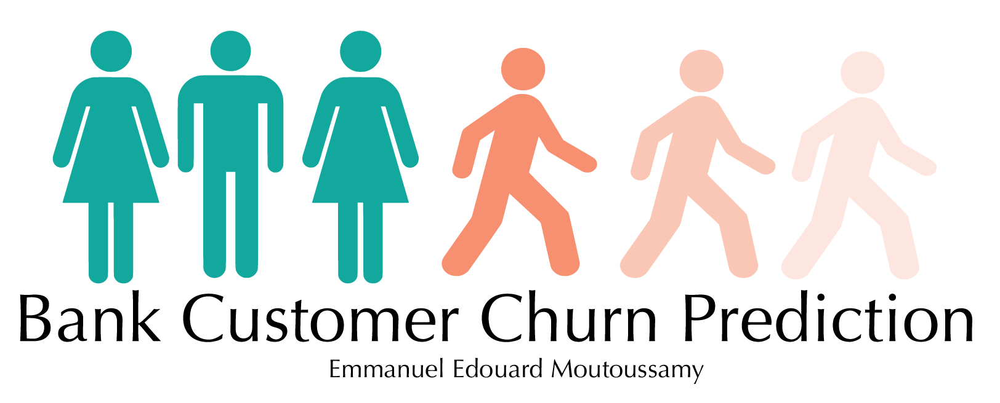

# BankCustomersChurnPred
 

### Author: Emmanuel Edouard Moutoussamy (https://tinyurl.com/3f7ddem8)

The goal of this project is to (1) detect the descriptor that influence the costumer churn and (2) build a model to predict the costumer churn.
The dataset used is availbale on Kaggle: https://tinyurl.com/ud43n28s

#### Summary:
### 1. Introduction
### 2. Data exploration
### 3. Data preprocessing
### 4. Model building and assessment

