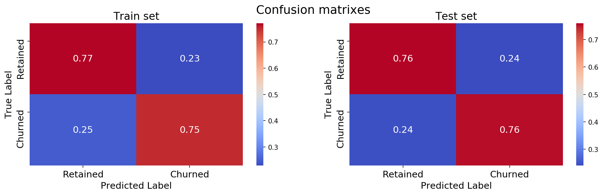
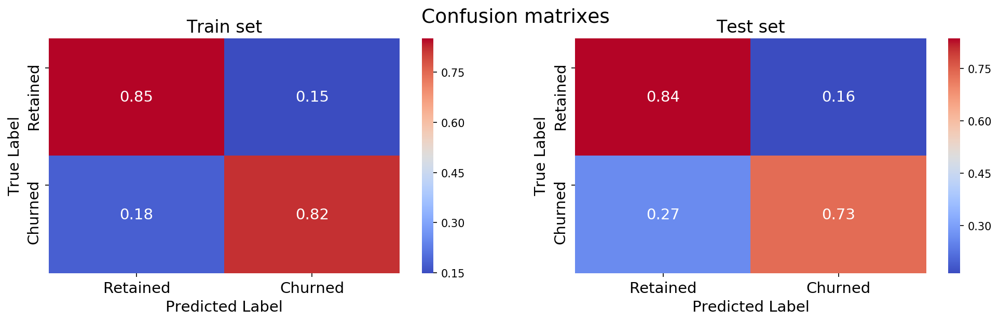
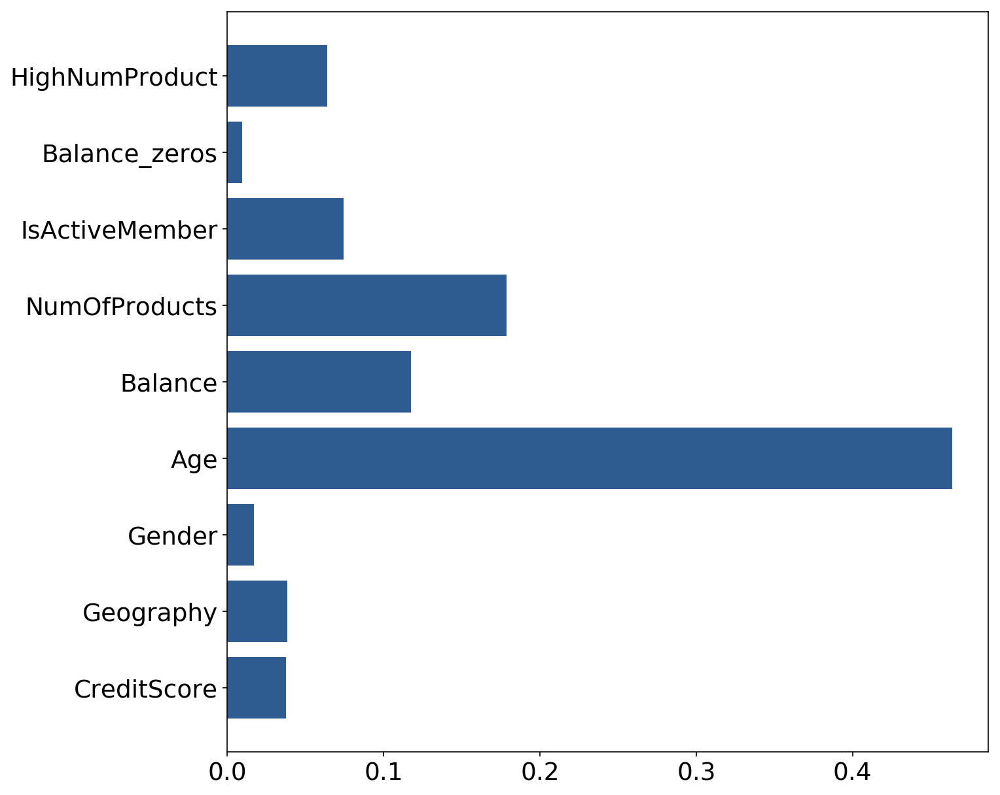

# BankCustomersChurnPred

#### FOR THE PYTHON CODE, PLEASE LOOK AT THE JUPYTER NOTEBOOK: BankCustomersChurnPred.ipynb

### Author: Emmanuel Edouard Moutoussamy (https://tinyurl.com/3f7ddem8)

The goal of this project is to (1) detect the descriptor that influence the customer churn and (2) build a model to predict the customer churn.
The dataset used is available on Kaggle: https://tinyurl.com/ud43n28s

### Summary:
1. Introduction
2. Data exploration
3. Data preprocessing
4. Model building and assessment

## 1. Introduction
### What is custumer churn ?

" Customer churn occurs when customers or subscribers stop doing business with a company or service. Also known as customer attrition, customer churn is a critical metric because it is much less expensive to retain existing customers than it is to acquire new customers " - Molly Galetto (https://tinyurl.com/yjs9shrk)

Customer churn is a critical metric for banks. Indeed, a costumer leaving represents a significant investment lost. Both time and effort need to be channelled into replacing them. The prediction of the customer churn is a powerful tool for the bank to avoid this lost.

In this project, I will dig into the data, visualize them and build a model to predict the customer churn. I will use a random forest and logistic regression algorithm.

## 2. Data exploration 

Here is the descriptors available on the data set:

- RowNumber          10000 non-null int64
- CustomerId         10000 non-null int64
- Surname            10000 non-null object
- CreditScore        10000 non-null int64
- Geography          10000 non-null object
- Gender             10000 non-null object
- Age                10000 non-null int64
- Tenure             10000 non-null int64
- Balance            10000 non-null float64
- NumOfProducts      10000 non-null int64
- HasCrCard          10000 non-null int64
- IsActiveMember     10000 non-null int64
- EstimatedSalary    10000 non-null float64
- Exited             10000 non-null int64

There are 14 descriptors and 10000 entry. There is no missing values on the dataset (Good news )

However, we can see that some descriptors are useless for the purpose of this project. Indeed, the row number, the customer id, and the surname does not play a role in the customer churn. These descriptors will be removed for the rest of the project.

We can distinguish two types of descriptors: continuous and categorical descriptors. I will visualize them separately.

### Data visualisation

First, I look at the proportion of customers who left the company on this dataset:

It appears that 20.4% of the customers left the bank in this dataset. We can see an over-representation of the retained customers in this dataset, this imbalance can bias the modeling.

### Categorical variables 

Here, the categorical variables give us some interesting information:
- The churn rate is higher for women than men
- The churn rate is higher for the German customers (highest churn rate). French and Spanish customers have the same churn rate. It could be interesting to put the Spanish and the French in the same group.
- Having a credit is not a key feature for the customer churn
- As expected, non-active members present a higher churn rate

Now let's test the correlation:

| Variable	       |  Chi-square   |	p-value.   |
|:-----------------|:-------------:|--------------:|
| Geography        |  301.255337   | 3.830318e-66. |
| IsActiveMember   |  242.985342   | 8.785858e-55. |
| Gender	       |   112.918571  | 2.248210e-26. |
| HasCrCard        |  	0.471338   | 4.923724e-01. |

The chi2 test confirm that having a credit card is not a key feature here. I will remove it.

### Continuous variables

Here, the continuous variables give us some interesting information:
- The credits score is not different between the churned and retained customers.
- The average age of the retained customers seems to be lower than the churned customers.
- The tenure does not seem to be different between the churned and retained customers.
- We can see a clear difference in the balance of the churned and retained customers.
- The retained customers present mostly one or two products.
- The estimated salary does not seem to be different between the churned and retained customers.

#### let's check the density of Age and Balance descriptors:

##### Age

    The avgerage age of churned customers is 44.84 against 37.41 for the retained customers

Indeed, the average age of the churned customers is higher than the retained customers (37 vs 45).
This information is crucial for the modeling.

##### Balance

    The avgerage age of churned customers is 91108.54 against 72745.3 for the retained customers
    
For the balance, we can see two peaks both distributions: 0 and around 125 000. we can see that there are more customers with a balance = 0 that stayed on the bank. This is even more visible on the following barplot:

I noticed that the customers with a non-null balance are part of the retained customers. Let's make a categorical variable based on this information.

# 3. Data preprocessing

## Descriptor engineering

In this section I will create new descriptors based on the last section.

I made two observations on the continuous variables:

(1) customers with a high number of products tend to leave the bank
(2) customers with a balance non-null tend to leave the bank

let's make two descriptors based on these observations

## Dropping of the non-useful descriptors

Based on the last analysis we point out some non-essential features: 'Tenure', 'HasCrCard', 'EstimatedSalary'. Let's drop them!

## Encoding of categorical descriptors

Encoding of: 

- The gender (1: Male;0: female)
- Geography. As mentioned above, I will merge Spain and French customers (0: Spain + France; 1: Germany)
- For the active members, I will change the coding for -1 when the customer is an active member.

## Scaling the continuous descriptors

I will scale the continuous descriptors with the Min Max Scaler.

# Models Building

I will build two models using logistic regression and random forest. The advantage of random forest is that we can extract the importance of each descriptor for the model.

## Logistic regression
I found the best parameters using GridSearch:
{'C': 0.5, 'fit_intercept': True, 'intercept_scaling': 1, 'max_iter': 250, 'penalty': 'l2', 'tol': 1e-05}

## Random Forest
I found the best parameters using GridSearch:
RandomForestClassifier(max_depth=8, max_features=8, min_samples_leaf=2,
                       min_samples_split=5, n_estimators=50)
                       

## Importance of each descriptors

With the Random Forest, it is possible to access to the relative importance of each descriptor with respect to the others.

Here are the descriptors by order of importance:

    1. Age
    2. Number of products
    3. Balance
    4. is active member
    5. High number of products
    6. Geography
    7. Credit score
    8. Gender
    9. balance zeros

# Conclusion
In this project, I built a model to predict the bank customer churn. First, I explore the dataset and I found that:

- The churn rate is higher for the German customers (highest churn rate). French and Spanish customers have the same churn rate.
- Having a credit is not key feature for the customer churn
- Non-active members present a higher churn rate
- The average age of the retained customers seems to be lower than the churned customers
- We can see a clear difference in the balance of the churned and retained customers.
- The retained customers present mostly one or two products

The importance analysis with the random forest methods confirm these observations. The most important descriptor for the customer churn prediction is the age.
We made models for the churn prediction with a precision around 0.7 and a recall around 0.7. However, we can note that the precision of the RF model to predict the churn clients is low (0.53). Here, we work on data on a given time point. A more meaningful model can be created with time average data. We can also add more descriptors such as the presence of saving accounts or the numbers of debit/credit cards.
